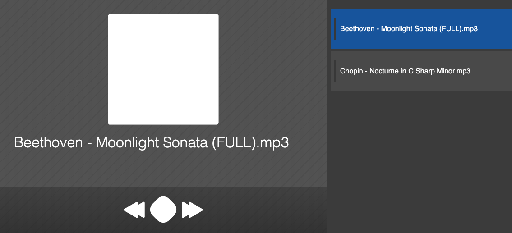

#   Fancy Music Player (Fmp)



A simple and lightweight music player built with Electron.

The application features a pleasant dark-theme (for the night-owls) and an easy to use interface. Simply drag-and-drop your audio files or audio file folder into the application and enjoy the music.

### Why did you make this?
After using VLC and other audio players for many years, I wanted to have a tool that solves the simple task of playlist and audio management while also looking great on any system and being customisable by the end-user.

I created this application to be my primary audio-playing application on my system

### How do I use it?
Simply start the application and drag-and-drop your desired music files in.

### How to build the project?
This project uses the electron-webpack library.
To compile and run the project:
```
yarn
yarn dev
```

### How does it work?
This application uses the electron framework and takes advantage of the webaudio api. Internally the logic creates a new instance of the `Audio` class and delegates all audio streaming on the device to it.

### RAM usage
When testing on a macbook air 2011, the memory usage capped out at 29 Megabytes.
